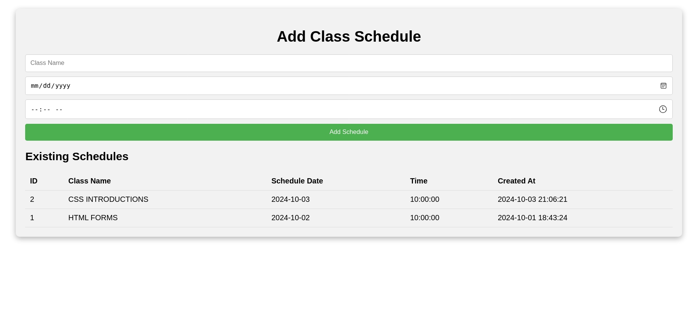

# ScholarWeb

ScholarWeb is a platform designed to help students manage their web development coursework, providing easy access to class notes, tasks, homework, and schedules. Though originally built for web development classes, ScholarWeb can be adapted by any educational institutions or tutoring services to manage their own courses and student activities.

## Installation

ScholarWeb is best deployed on a web server, making it accessible from anywhere for students and administrators. For hosting or deployment inquiries, including pricing details, please contact us.

Curently deployed on Serv00.net

### Software Requirements
- PHP 5.0 or above
- MySQL or compatible database
- Web server such as Apache or Nginx

## Core Features

**User Section:**
- **Profile:** Users can view and update their profiles.
- **Feed:** Students can post doubts and questions, engaging with others through likes and replies.
- **Tasks:** View assigned tasks, deadlines, and submission status.
- **Homework:** Submit homework and track submissions.
- **Progress:** Monitor progress through modules and topics.
- **Activities:** Log and view activities within the platform.
- **Notifications:** Receive updates and important notifications.
- **Settings:** Customize account settings.
- **Logout:** Securely log out of the application.

**Admin Section:**
- **Add User:** Create new user accounts for students.
- **Manage Users:** View, edit, and delete user accounts.
- **Generate Task:** Create new tasks for students.
- **Create Tasks:** Add detailed tasks with deadlines and requirements.
- **Edit Tasks:** Modify existing tasks as needed.
- **Manage Schedules:** Control class schedules and timings.
- **Add Notifications:** Send important messages to users.
- **Manage Modules:** Create and edit modules for coursework.
- **Messages:** View and manage messages between users and admin.
- **View Logs:** Access logs for user activities and actions.
- **Delete Activity:** Remove activity logs as necessary.
- **View Homework:** Check homework submissions from users.
- **Update Payments:** Manage payment statuses and records.
- **Add Updates:** Post updates relevant to the courses or users.

## Usage

**User Flow:**
1. **Landing Page:** Users arrive at the ScholarWeb landing page.
2. **Login:** Users log in with their credentials.
3. **Profile or Dashboard:** After logging in, users are directed to their profile or dashboard, where they can see an overview of:
   - Schedules
   - Tasks
   - Homework submissions
   - Notifications
   - Study materials
   - Contact support

Users can navigate to specific sections for detailed views and actions.

**Admin Flow:**
1. **Landing Page:** Admins access the ScholarWeb landing page.
2. **Login:** Admins log in with their credentials.
3. **Admin Dashboard:** Admins are taken to their dashboard, featuring quick overviews at the top:
   - Total Users
   - Total Tasks
   - Messages Received
   - Total Schedules

Admins can then access various options for managing users, tasks, schedules, and more.

## Technologies Used

ScholarWeb is developed using a custom approach, with all features and functionalities built from the ground up. The platform does not rely on external libraries or frameworks, allowing for complete control over every aspect, from the structure of pages to individual components like buttons.

## Future Enhancements

ScholarWeb is primarily developed for use in the web development classes that i am currently teaching, and its features will evolve based on user needs and feedback.
#### Recent Updates on Users needs :

- **Profile Image Support:** Recent enhancements include the addition of profile image upload functionality.
- **Image Upload in Feed:** An image upload option for the feed section allows students to attach images of their problems instead of only writing out their doubts.

#### Future enhancements may include:

- **Dynamic Feature Development:** Features will be added or modified according to the requirements of students and their experiences.

## Accessing the Platform

Currently, ScholarWeb allows only registered users to sign up and log in, with access controlled by the admin. However, there are plans to implement a **Guest Section** that will allow others to view the platform's features and functionality without needing to enroll in any classess. This will provide potential users with a better understanding of what ScholarWeb offers before committing to registration.

## License

ScholarWeb is licensed under the [MIT License](https://opensource.org/licenses/MIT). This allows users to freely use, modify, and distribute the software while providing attribution to the original author.

## Contact Information

For questions, feedback, or support, please reach out via email at:  
**[srisumit96@gmail.com](mailto:srisumit96@gmail.com)**

### Screenshots

Screenshots and images of the ScholarWeb platform are uploaded here.

**Landing Page**

**Login page**

**Dashboard Cropped**

**Profile page Uncropped**

**All User Pages are Responsive**

**Responsive Profile page** 

**Feed page**

**Task page**

**Homework page**

**Notification page**

**Progress Page**

**Settings page**

**Contact Page**

---

### Admin Section

**Admin Dashboard**

**View All Users**

**Admin Generate Tasks**

**Admin Edit Task page**

**Admin Schedules**

**Admin Messages**

**Admin Logs**

**Admin Homework**

**Admin Payments**

**Admin Updates**

**Admin Modules**

**Admin Add User page**

**There are more pages consisting of different Sub-Features Visit the page to explore**

---